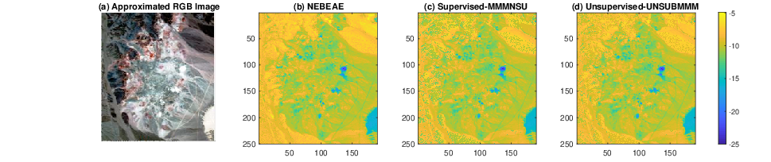

# NEBEAE
Matlab implementation of Nonlinear Extended Blind End-member and Abundance Extraction (NEBEAE) algorithm.   
NEBEAE implements a blind hyperspectral unmixing based on the multilinear mixing model [(MMM)](10.1109/TGRS.2015.2453915). 

In the problem formulation, we include a normalization step in the hyperspectral measurements for the end-members and abundances to improve robustness. 
The blind unmixing process can be separated into three estimation subproblems for each component in the model, which are solved by a cyclic coordinate descent algorithm and quadratic constrained optimizations. Each problem is mathematically formulated and derived to construct the overall nonlinear iterative unmixing technique.  

We evaluated our proposal with synthetic and experimental datasets from the remote sensing literature (Cuprite and Urban datasets).  

The performance is compared with two state-of-the-art unmixing methods based on MMM: (i) Multilinear Mixing Model for Nonlinear Spectral Unmixing [(MMMNSU)](https://doi.org/10.1109/TGRS.2015.2453915) (end-members initialized by [VCA](https://doi.org/10.1109/TGRS.2005.844293)), and (ii) Unsupervised Nonlinear Spectral Unmixing Based on MMM [(UNSUBMMM)](https://doi.org/10.1109/TGRS.2017.2693366).  

The file PlotSyntheticTestVNIR.m evaluates the unmixing of the syntetic dataset. As example, the following image shows the estimated abundance maps, and the histogram of the resulting nonlinear interaction level.  

   
 
 The file PlotNonLinearTestCuprite.m evaluates the unmixing of the Cuprite dataset. As example, the following image shows the map of resulting the nonlinear interaction level. 
 
   
 
 The file PlotNonLinearTestCuprite.m evaluates the unmixing of the for Urban Dataset.
 
 
 
 | [Paper]()   
 Nonlinear Extended Blind End-member and Abundance Extraction for Hyperspectral Images  
 [Daniel U. Campos-Delgado](https://orcid.org/0000-0002-1555-0131)1,2, 
 [Inés A. Cruz-Guerrero](https://orcid.org/0000-0001-8034-8530)2 
 [Juan N. Mendoza-Chavarría](https://orcid.org/0000-0001-9740-1190)2, 
 [Aldo R. Mejía-Rodríguez](https://orcid.org/0000-0003-0704-0681)2, 
 [Samuel Ortega](https://orcid.org/0000-0002-7519-954X)3,4,
 [Himar Fabelo](https://orcid.org/0000-0002-9794-490X)4,
 [Gustavo M. Callico](https://orcid.org/0000-0002-3784-5504)4  
 1Optical Communication Research Institute (IICO), Autonomous University of San Luis Potosí, Av. Karakorum 1470, 78210, S.L.P., México 
2Faculty of Science, Autonomous University of San Luis Potosí, Av. Parque Chapultepec 1570, 78290, S.L.P., Mexico 
3Norwegian Institute of Food Fisheries and Aquaculture Research (NOFIMA), 9019 Tromsø, Norway 
4Institute for Applied Microelectronics (IUMA), University of Las Palmas de Gran Canaria, E35017 Las Palmas de Gran Canaria, Spain 
Submitted to Signal Processing (Elsevier).

 
